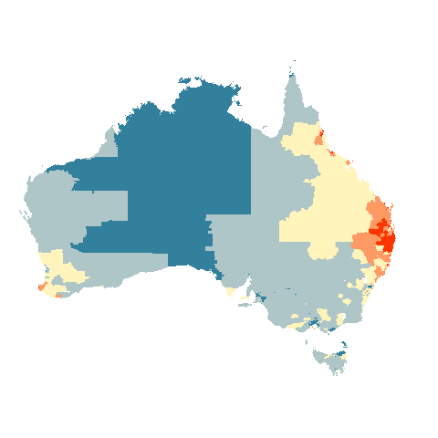

class: bottom, right, title-slide


## An Australian alternative
## to choropleth maps;
## visualising geo-spatial
## disease data

### Stephanie Kobakian
### [srkobakian](https://github.com/srkobakian) `r icon::fontawesome("twitter")``r icon::fontawesome("github")` 


```{r setup, include=FALSE}
options(htmltools.dir.version = FALSE, message = FALSE, warning = FALSE, echo = FALSE)
```
???

Good afternoon,
My name is Stephanie

---


class: bg-main1 split-30 

.column.bg-deep-green[
]
.column.bg-green[

# Superisory Team
<br>

## Professor Kerrie Mengersen

<br>

## Doctor Earl Duncan 

<br>

## Professor Di Cook

]


---


class: bg-main1 split-30 

.column.bg-deep-green[
<br><br><br><br><br><br><br><br><br><br><br><br><br><br>
Professor Peter Baade
<br><br><br><br><br><br><br><br><br><br><br>
Dr Susanna Cramb
]
.column.bg-green[
<br>
# Motivation

## Australian Cancer Atlas

]


???

With the help of Dr Peter Baade and Dr Susanna Cramb were key contributors to the Atlas. They also gave a lot of time and effort to help me with my work and my contributions to the Atlas.

ViseR at QUT and The Cancer Caner of Queensland were also extremely valuable contributors.

---

class: bg-deep-green

# Australia

## - Standardised Incidence Rate
## - Lung cancer
## - Average for 2010-2014
## - Males and Females

---


class: bg-deep-green, center


background-image: url(figures/atlases/australia_lung.png)
background-position: 50% 85%
background-size: 60%

 

# Lung Cancer in Australia

???

What do you learn about Lung cancer in Australia?

Red for Standardised Incidence Rates much higher than Australian Average.
Yellow arounf the average,
Dark blue for areas less than the average.

- Red areas in Northern Territory and Northern QLD
- Red in Tasmania
- Blue near capital cities

---

class: bg-deep-green, center


background-image: url(figures/atlases/australia_lung.png)
background-position: 50% 85%
background-size: 60%

 


# Choropleth map

???

What is a choropleth map?

Coloured map, each area has boundaries drawn.
Colour is determined by the statistic.

---

class: bg-deep-green, center

# Statistical Areas

### - Australian Bureau of Statistics (ABS)
### - 2148 populated Statistical Areas at Level 2 (SA2s)
### - SA2 is the smallest area for the release of many ABS statistics
<br>
### - Reflect functional areas, communities
###  (Interact together socially and economically)
### - Population range of 3,000 to 25,000 persons
###  (Average population of about 10,000 persons)

---


class: bg-deep-green, center

# Online cancer atlases

.pull-left[

```{r, out.height = "250px", out.width="500px", echo = FALSE}

```

```{r, out.height = "250px", out.width="500px", echo = FALSE}
knitr::include_graphics("figures/atlases/global_the cancer atlas_app4.png")
```

]
.pull-right[

```{r, out.height = "250px", out.width="500px", echo = FALSE}

```


```{r, out.height = "250px", out.width="500px", echo = FALSE}

```

]


???

Well used in practice

Familiar

Only one new piece of information

---

background-image: url(figures/quote.png)
background-position: 50% 50%
background-size: 90%

---

class: bg-deep-green, center

background-image: url(figures/atlases/australia_comparing.png)
background-position: 50% 70%
background-size: 80%

# Comparing two areas

---

class: split-60 center

.column.bg-deep-green[.content[
<br><br>
# Choropleth

```{r, out.width = "550px", echo = FALSE}

```
<br><br>

.footnote[
[package: sf](https://cran.r-project.org/web/packages/sf/index.html)
]
]]
.column.bg-main4[.content.middle[
<br><br>

#Features:
<br><br>
### - Familiar shapes of areas
<br>
### - Familiar boundary relationships

]]

---

class: bg-deep-green, center, middle

# Alternative
# Options

---

class: split-60 center

.column.bg-deep-green[.content[
<br>
# Contiguous 
# Cartogram

```{r, out.width = "500px", echo = FALSE}

```
<br><br>

.footnote[
[package used: cartogram](https://cran.r-project.org/web/packages/cartogram/index.html)
]

]]
.column.bg-main4[.content.middle[
<br><br>

#Features:
### - Boundaries stay connected
### - Shapes change
### - Provide amount of iterations

#Issue:
### `r icon::fontawesome("times")` May not complete within iteration limit

]]
---

class: split-60 center

.column.bg-deep-green[.content[
<br>
# Non - Contiguous 
# Cartogram

```{r, out.width = "500px", echo = FALSE}

```
<br><br>

.footnote[
[package used: cartogram](https://cran.r-project.org/web/packages/cartogram/index.html)
]

]]
.column.bg-main4[.content.middle[
<br><br>

#Features:
### - Shapes stay
### - Boundaries lose connections
### `r icon::fontawesome("check")` Completed transformation


#Issue:
### `r icon::fontawesome("times")` Cannot see the areas

]]

---


class: split-60 center

.column.bg-deep-green[.content[
<br>
# Dorling 
# Cartogram

```{r, out.width = "500px", echo = FALSE}

```
<br><br>

.footnote[
[package used: cartogram](https://cran.r-project.org/web/packages/cartogram/index.html)
]

]]
.column.bg-main4[.content.middle[
<br><br>

#Features:
### - Shapes are consistent
### - Boundaries still touch
### `r icon::fontawesome("check")` Can see all the areas


#Issue:
### `r icon::fontawesome("times")` Lost geographic reference

]]


---


class: bg-deep-green
# USA 

## Age Adjusted Rate
## Lung and Bronchus
## 2012-2016
## Male and Female	

### The official federal statistics on cancer incidence and deaths
### [source: Centers for Disease Control and Prevention (CDC) and the National Cancer Institute (NCI).](https://gis.cdc.gov/cancer/USCS/DataViz.html)

---

class: bg-main2, center

background-image: url(figures/ggchoro.png)
background-position: 50% 50%
background-size: 75%

# USA: Choropleth

.footnote[
[package used: sf](https://cran.r-project.org/web/packages/sf/index.html)
]

???

---

class: bg-main2, center

background-image: url(figures/ggcont.png)
background-position: 50% 50%
background-size: 80%

# USA: Contiguous Cartogram

.footnote[
[package used: cartogram](https://cran.r-project.org/web/packages/cartogram/index.html)
]

---
class: bg-main2, center


background-image: url(figures/ggncont.png)
background-position: 50% 50%
background-size: 80%

# USA: Non-Contiguous Cartogram

.footnote[
[package used: cartogram](https://cran.r-project.org/web/packages/cartogram/index.html)
]

---
class: bg-main2, center

background-image: url(figures/ggdorl.png)
background-position: 50% 50%
background-size: 80%

# USA: Dorling Cartogram

.footnote[
[package used: cartogram](https://cran.r-project.org/web/packages/cartogram/index.html)
]

---

class: split-60 center

.column.bg-deep-green[.content[
<br>

# USA: Tilegram

```{r, out.width = "500px", echo = FALSE}

```
<br><br>

.footnote[
[tilegramR](https://cran.r-project.org/web/packages/tilegramR/index.html)
]

]]
.column.bg-main4[.content.middle[
<br>
#Features:
### - Shapes are consistent
### - Boundaries may still touch
### `r icon::fontawesome("check")` Can see all the areas
### `r icon::fontawesome("check")` Maintains geographic reference

#Issue:
### `r icon::fontawesome("times")` Hand drawn grid

]]

---

class: split-60 center

.column.bg-deep-green[.content[
<br>

# USA: Geo-Facet map

```{r, out.width = "650px",out.height = "400px", echo = FALSE}

```
<br><br>


.footnote[
[geofacet](https://cran.r-project.org/web/packages/geofacet/index.html)
]
]

]]
.column.bg-main4[.content.middle[
<br><br>
#Features:
### - Any visualisation can be drawn
### - Boundaries may still touch
### `r icon::fontawesome("check")` Can see all the areas
### `r icon::fontawesome("check")` Maintains geographic reference

#Issue:
### `r icon::fontawesome("times")` Hand drawn grid

]]

---

class: bg-deep-green, center

## International Agency for Research on Cancer

.pull-left[

```{r, out.width = "465px", echo = FALSE}
knitr::include_graphics("figures/atlases/iarc/cancertoday1.png")
```

```{r, out.width = "465px", echo = FALSE}
knitr::include_graphics("figures/atlases/iarc/cancertoday2.png")
```

]
.pull-right[

```{r, out.width = "465px", echo = FALSE}
knitr::include_graphics("figures/atlases/iarc/cancertoday3.png")
```


```{r, out.width = "465px", echo = FALSE}
knitr::include_graphics("figures/atlases/iarc/cancertoday4.png")
```

]

---

class: split-50 center

.column.bg-deep-green[.content[
<br>
<br><br>
# Motivation

## Contrast all communities

<br>

# Population Displays

## - Great alternatives
## - Shifts the focus

]]
.column.bg-main4[.content[
<br>
<br>
<br><br>
# Challenge

## - Hand drawn
## - Cannot see the areas
## - May loose geographic reference

]]

---

class: split-50

.column.bg-deep-green[.content[
<br>
.center[
```{r, out.width = "500px", echo = FALSE}

```
]]]
.column.bg-main4[.content[
<br>
<br>
<br><br>
# Challenges

## - Hand drawn
## - Cannot see the areas
## - May loose geographic reference

]]

---

class: split-50

.column.bg-deep-green[.content[
<br>
.center[
```{r, out.width = "500px", echo = FALSE}

```
]]]
.column.bg-main4[.content[
<br>
<br>
<br><br>
# Solutions:

## - Algorithm
## - Equally sized areas
## - Focal points,
##  buffering & angles 

]]
---

class: bg-main2, center

# Tasmania

.pull-left[

```{r, out.width = "500px", echo = FALSE}

```
]
.pull-right[
<br>
<br>
<br>
## SA2s
## 98 areas
]

---

class: bg-main2, center

# Create a square grid
.pull-left[

```{r, out.width = "500px", echo = FALSE}

```
]
.pull-right[
<br>
<br>
## - Equally spaced
## rows and columns
## - Covers all centroids
## - Expands by a buffer zone
]


---


class: bg-main2, center

# Create a hexagon grid
.pull-left[

```{r, out.width = "500px", echo = FALSE}

```
]
.pull-right[
<br>
<br>
## - Allows tesselating hexagons
## - Equally spaced rows
## - Covers all centroids
## - Expands by a buffer zone
]


---

class: bg-main2, center

# Strategic buffering
.pull-left[

```{r, out.width = "500px", echo = FALSE}

```
]
.pull-right[
<br>
<br>
## - Filters within a buffer zone
## - Allows tesselating hexagons
## - Equally spaced rows
## - Covers all centroids
]

---

class: bg-main2, center, middle

# Set up completed 
# `r icon::fontawesome("check")`
# Ready to allocate

---

class: bg-main2, center

# Allocating

## Provide focal points

```{r, out.width = "600px", echo = FALSE}

```

---

class: bg-main2, center

# Begin filtering hexagon points
.pull-left[

```{r, out.width = "500px", echo = FALSE}

```
]
.pull-right[

```{r, out.width = "500px", echo = FALSE}

```
]


---
class: bg-main2, center

# Angled filter for hexagon points
.pull-left[

```{r, out.width = "500px", echo = FALSE}

```
]
.pull-right[

```{r, out.width = "500px", echo = FALSE}

```
]

---
class: bg-main2, center

# Closest available point
.pull-left[

```{r, out.width = "500px", echo = FALSE}

```
]
.pull-right[
## - Choose closest point
## - Angle maintains the spatial relationship

]

---

class: bg-main2, center

# Final product

```{r, out.width = "1000px", echo = FALSE}

```


---

class: split-50 bg-deep-green
# Using sugarbag

.left-code[

### 1. Create centroids set
```{r, echo = TRUE, eval = FALSE, out.with = "100px"}
centroids <- create_centroids(
   tas_sa2, 
   "sa2_name_2011")
```
<br>
### 2. Create hexagon grid
```{r, echo = TRUE, eval = FALSE, out.with = "100px"}
grid <- create_grid(
   centroids = centroids, 
   hex_size = 0.2, 
   buffer_dist = 1.2)
```
]
.pull-right[
### 3. Allocate polygon centroids
###  to the hexagon grid 

```{r, echo = TRUE, eval = FALSE}
allocated <- allocate(
   centroids = centroids,
   sf_id = "sa2_name_2011",
   hex_grid = grid,
   hex_size = 0.2,
   hex_filter = 1,
   use_neighbours = tas_sa2,
   width = 30,
   focal_points = capital_cities,
   verbose = TRUE
 )

```
]

---

class: bg-main2
# Shortcut

```{r, echo = TRUE, eval = FALSE}
hexmap <- create_hexmap(
   shp = tas_sa2,
   sf_id = "sa2_name_2011",
   neighbours = tas_sa2,
   focal_points = capital_cities,
   verbose = TRUE
)
```


---

class: split-50 center


.column.bg-deep-green[.content[
# Lung (persons)

]]
.column.bg-deep-green[.content[

]]


---

class: split-50 center


.column.bg-deep-green[.content[
# Liver (females)

]]
.column.bg-deep-green[.content[

]]

---

class: split-50 center


.column.bg-deep-green[.content[
# Liver (males)

]]
.column.bg-deep-green[.content[

]]

---

class: split-50 center


.column.bg-deep-green[.content[
# Melanoma (persons)

]]
.column.bg-deep-green[.content[

]]


---

class: bg-deep-green, center


```{r, out.width = "700px", out.height = "700px", echo = FALSE}

```

---


class: bg-black, center


 

# Line up experiment

#### Same data, different display


???
position 12, replicate 9
Is this a better way to present data.
Lineup protocol: 12 possible locations, one real data set 

Pick the map that is most different?


---

class: bg-deep-green, center

# Experimental Design

```{r, out.height = "450px", out.width="700px", echo = FALSE}


```

---

class: bg-black, center

# Your turn (a)


---
class: bg-black, center
# Your turn (b)


---


class: bg-black, center

# Your turn (a) Map 12


---
class: bg-black, center
# Your turn (b) Map 9


---
class: bg-black, center
# Your turn (a)


---

class: bg-black, center
# Your turn (b)


---
class: bg-black, center
# Your turn (a) Map 9


---
class: bg-black, center
# Your turn (b) Map 6


---


class: bg-black, center


# Probability of detection 
---

class: bg-deep-green

# References

1. Dougenik JA, Chrisman NR, Niemeyer DR. An Algorithm to Construct Continuous Area Cartograms. The Professional Geographer 1985;37:75–81. doi:10.1111/j.0033-0124.1985.00075.x.
1. Olson JM. Noncontiguous Area Cartograms. The Professional Geographer 1976;28:371–80. doi:10.1111/j.0033-0124.1976.00371.x.
1. Dorling D. Area Cartograms: Their Use and Creation. In:. Concepts and techniques in modern geography (catmog), vol. 59, 2011, pp. 252–60. doi:10.1002/9780470979587.ch33.
1. Buja, A., D. Cook, and D. Swayne. (1999). “Inference for Data Visualization.” In Talk given at Joint Statistical Meetings. Baltimore, Maryland. Accessed 11 November 2019 from http://www-stat.wharton.upenn.edu/~buja/PAPERS/visual-inference.pdf.

1. Pebesma, E., 2018. Simple Features for R: Standardized Support for
  Spatial Vector Data. The R Journal 10 (1), 439-446,  https://doi.org/10.32614/RJ-2018-009
1. H. Wickham. ggplot2: Elegant Graphics for Data Analysis. Springer-Verlag  New York, 2016.
1. Hadley Wickham (2017). tidyverse: Easily Install and Load the  'Tidyverse'. R package version 1.2.1.
  https://CRAN.R-project.org/package=tidyverse
1. Sebastian Jeworutzki (2018). cartogram: Create Cartograms with R. R package version 0.1.1.   https://CRAN.R-project.org/package=cartogram
1. Bob Rudis (2017). statebins: Create 'U.S.' Uniform Square State Cartogram Heatmaps. R package   version 2.0.0. https://github.com/hrbrmstr/statebins

 


---

class: bg-deep-green

# With thanks:
### Prof Di cook
### Prof Kerrie Mengersen
### Dr. Earl Duncan

<br><br>
### created with xaringan <i class="fas fa-user-ninja"></i> and [kunoichi](https://github.com/emitanaka/ninja-theme)

### scripts and data available [srkobakian](https://github.com/srkobakian)

### sugarbag maps [srkobakian/sugarbag](https://github.com/srkobakian/sugarbag)

<br><br>
#### This work is under licensed [`r icon::fontawesome("creative-commons")` BY-NC 4.0](https://creativecommons.org/licenses/by-nc/4.0/).

